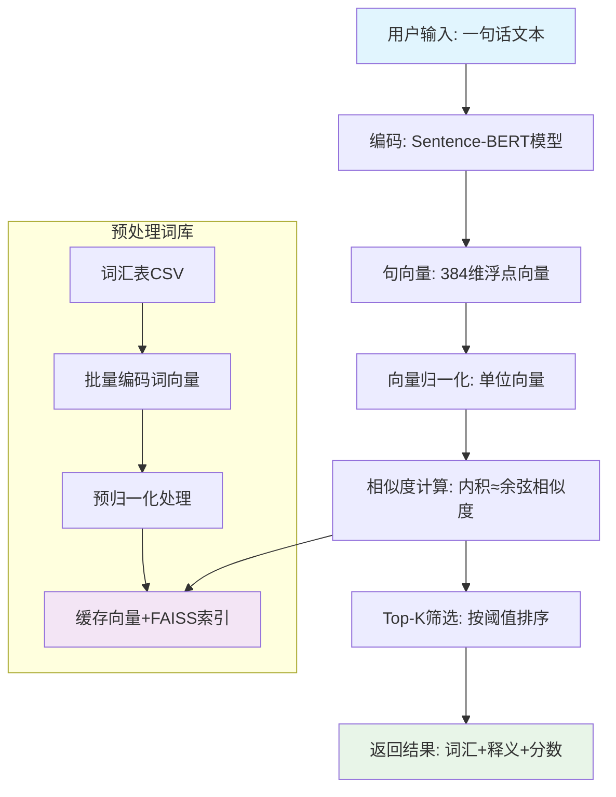
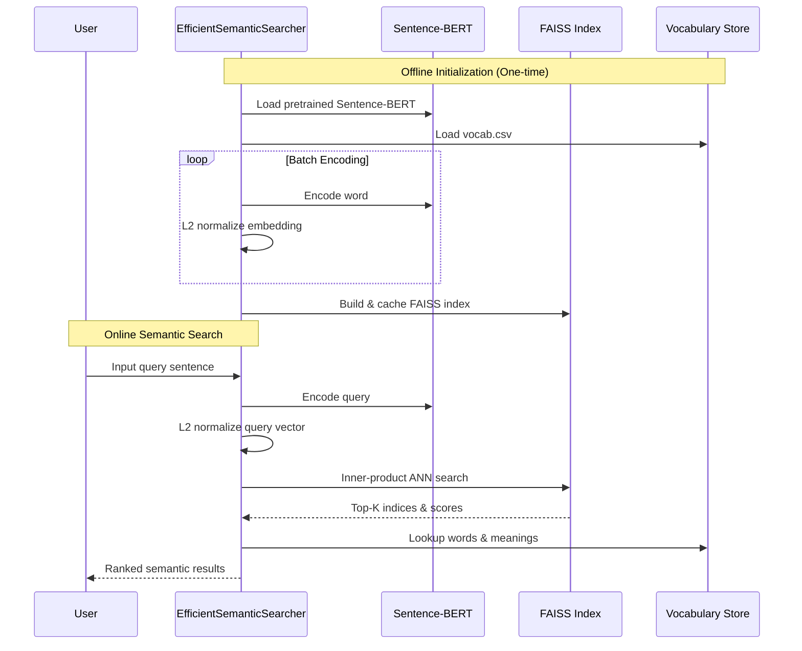

# Semantic Vocabulary Search System  
（基于 Sentence-BERT 的语义词汇检索系统）

---

## 1. 项目简介

本项目实现了一个 **基于 Sentence-BERT 的语义搜索系统**，  
能够将 **一句自然语言文本**（如 *“I love science” / “我爱科学”*）  
映射到高维语义向量空间，并在 **词汇语义库（8k 规模）** 中检索出：

- 语义最相关的单词
- 对应的词义说明
- 语义相似度得分（余弦相似度）

系统支持：
- **多语言（中英）**
- **高效向量搜索（FAISS）**
- **向量缓存（首次慢，后续秒开）**
- **Web API（Flask）**

---

## 2. 技术栈

| 模块 | 技术 |
|---|---|
| 语义编码 | Sentence-BERT |
| 预训练模型 | `paraphrase-multilingual-MiniLM-L12-v2` |
| 向量检索 | FAISS / NumPy |
| Web 服务 | Flask |
| 数据存储 | CSV |
| 向量缓存 | NumPy + Pickle |

---

## 3. 整体流程概览



- 你可以使用自己的数据集对它进行魔改
- 你可以不受限制的用于商业场景
- 希望这是一个有意思的玩具

## 4. 我觉得这个项目很有意思，但是怎么下载到本地？

- 检查电脑配置 操作系统：Windows 10/11、macOS 10.15+ 或 Ubuntu 18.04+  内存：至少 4GB（推荐 8GB+）硬盘空间：至少 2GB 可用空间

- 下载项目文件 您可以选择方法一或方法二

方法一：

打开 GitHub 项目页面

点击绿色的 Code 按钮

选择 Download ZIP

解压到桌面（或其他容易找到的位置）

方法二：

```bash
# 如果你安装了 Git
git clone https://github.com/你的用户名/项目名.git
cd 项目名

```

### 安装所有依赖（需要10-20分钟，耐心等待）
```bash
pip install -r requirements.txt
```

## 5.代码流程时序图


