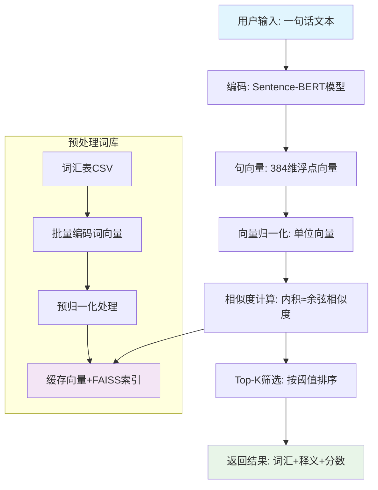
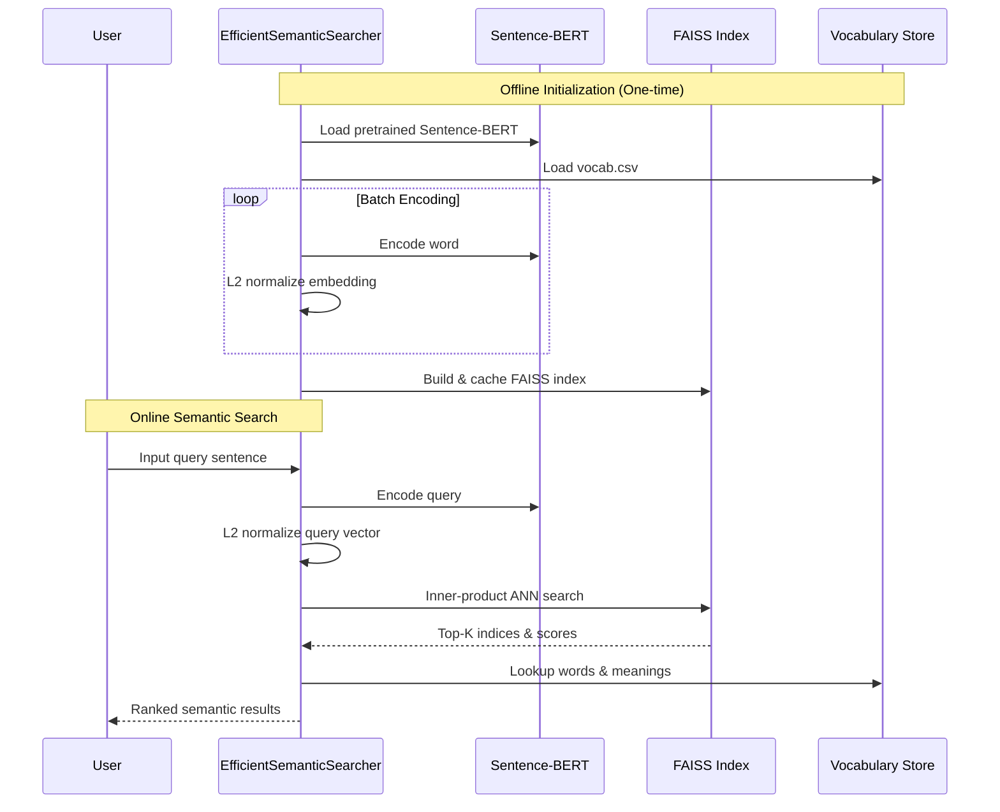
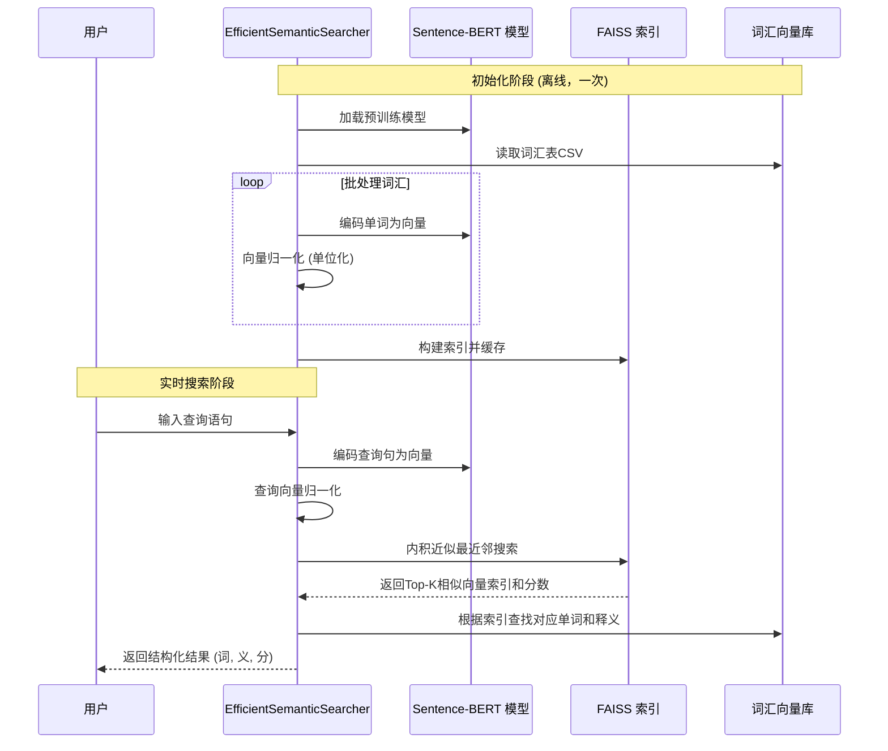

# Semantic Vocabulary Search System  
（基于 Sentence-BERT 的语义词汇检索系统）

---

## 1. 项目简介

本项目实现了一个 **基于 Sentence-BERT 的语义搜索系统**，  
能够将 **一句自然语言文本**（如 *“I love science” / “我爱科学”*）  
映射到高维语义向量空间，并在 **词汇语义库（8k 规模）** 中检索出：

- 语义最相关的单词
- 对应的词义说明
- 语义相似度得分（余弦相似度）

系统支持：
- **多语言（中英）**
- **高效向量搜索（FAISS）**
- **向量缓存（首次慢，后续秒开）**
- **Web API（Flask）**

---

## 2. 技术栈

| 模块 | 技术 |
|---|---|
| 语义编码 | Sentence-BERT |
| 预训练模型 | `paraphrase-multilingual-MiniLM-L12-v2` |
| 向量检索 | FAISS / NumPy |
| Web 服务 | Flask |
| 数据存储 | CSV |
| 向量缓存 | NumPy + Pickle |

---

## 3. 整体流程概览



- 你可以使用自己的数据集对它进行魔改
- 你可以不受限制的用于商业场景
- 希望这是一个有意思的玩具

## 4. 我觉得这个项目很有意思，但是怎么下载到本地？

- 检查电脑配置 操作系统：Windows 10/11、macOS 10.15+ 或 Ubuntu 18.04+  内存：至少 4GB（推荐 8GB+）硬盘空间：至少 2GB 可用空间

- 下载项目文件 您可以选择方法一或方法二

方法一：

打开 GitHub 项目页面

点击绿色的 Code 按钮

选择 Download ZIP

解压到桌面（或其他容易找到的位置）

方法二：

```bash
# 如果你安装了 Git
git clone https://github.com/你的用户名/项目名.git
cd 项目名

```

### 安装所有依赖（需要10-20分钟，耐心等待）
```bash
pip install -r requirements.txt
```

## 5.代码流程时序图



---


## 6.核心算法说明

本系统实现了一个基于 Sentence-BERT + 向量相似度搜索（FAISS） 的高效语义检索算法，用于将用户输入的自然语言句子，与词汇表中的单词进行语义匹配，并返回语义最相关的结果。

算法整体可分为 向量表示 → 向量归一化 → 相似度计算 → 高效检索 四个核心步骤。

---
### 0 前置知识

#### 0.1平均池化（Average Pooling）

假设一句话是：

```html
"I like machine learning"
```
模型先把它变成词向量（假设每个词是3维，为了好理解）：

```html
text
I    -> [1, 0, 0]
like -> [0, 1, 0]
machine -> [0, 0, 1]
learning -> [1, 1, 0]

```
平均池化就是：

句向量 = (所有词向量加起来) / 词数

```html
text
= ([1,0,0] + [0,1,0] + [0,0,1] + [1,1,0]) / 4
= [0.5, 0.5, 0.25]
```

我们看一个例子：

假设词向量（为了直觉，用2维）
```html
text
the    -> [0.1, 0.1]
cat    -> [0.9, 0.8]
is     -> [0.1, 0.1]
on     -> [0.2, 0.1]
the    -> [0.1, 0.1]
mat    -> [0.8, 0.9]
```
平均池化在干嘛？

```python
sentence_vec = (
    the + cat + is + on + the + mat
) / 6
```
结果会被 the / is / on 这些“废话词”严重拉低,导致模型被迫“认真对待废话”

TF-IDF 到底是什么？ （Term Frequency Inverse Document Frequency）

| 英文术语 | 中文翻译 | 含义解释 |
|---|---|---|
| Term Frequency (TF) | 词频 | 一个词在**单个文档**中出现的频率 |
| Inverse Document Frequency (IDF) | 逆文档频率 | 衡量一个词在**整个文档集合**中的普遍重要性 |

例子
```html
the cat and the dog
```
| 词   | 出现次数 |
| --- | ---- |
| the | 2    |
| cat | 1    |
| dog | 1    |

直觉：

出现多 → 可能重要

但这一步 不够（因为 the 出现最多，但它不重要）

IDF(word) = 如果这个词在“所有句子”里都很常见 → 它没啥信息量

例子

比如在一个大语料库里面

| 词     | 出现在哪些句子 |
| ----- | ------- |
| the   | 几乎所有句子  |
| cat   | 一部分     |
| quark | 很少      |

```html
IDF(the)   → 很小
IDF(cat)   → 中等
IDF(quark) → 很大
```

一般结论：“越稀有，信息量越大”

```html
TF-IDF(word) = 
    这个词在当前句子中重要吗？
    ×
    这个词在整个语料中稀有吗？
```

例子

| 词     | TF | IDF | TF-IDF |
| ----- | -- | --- | ------ |
| the   | 高  | 极低  | 低      |
| cat   | 中  | 中   | 中      |
| mat   | 中  | 中   | 中      |
| quark | 低  | 极高  | 中      |

通过 TF-IDF 废话词被自然压低

对应核心代码
```python
sentence_vec = sum(tfidf[i] * word_vec[i]) / sum(tfidf)
```
```html
问：word_vec[i] 是什么?
答：第 i 个词的向量 ， 它的形状通常是 word_vec[i].shape == (d,) 其中“d，”表示[0.9, 0.8, ..., 0.1]  # d = 768

问：tfidf[i] 是什么？
答：第 i 个词的“重要性分数”（一个标量）

问： tfidf[i] * word_vec[i] 在做什么？
答： "让重要的词，在句向量里声音更大"

问： sum(tfidf[i] * word_vec[i])在做什么？
答： 把“加权后的词向量”全部加起来

问： 为什么要 / sum(tfidf)？如果不除，会发生什么？
答：  词多的句子 → 向量模长更大 相似度比较会被长度干扰 除以 sum(tfidf) 的作用是把句向量拉回到"平均尺度",其本质是加权平均，而不是"加权求和"

问： 那为什么现在大家很少“只用 TF-IDF”？
答： 请往下看

```
TF-IDF 的极限

| 问题    | 原因               |
| ----- | ---------------- |
| 不懂语序  | 仍然是“袋子”          |
| 不懂上下文 | bank 还是 bank     |
| 同义词无感 | car ≠ automobile |
| 不能泛化  | 词没见过就废           |


---

### 1 词与句子的向量化表示（Embedding）

#### 1.1 为什么需要向量表示？

自然语言（单词、句子）本质上是离散符号，无法直接进行数学计算。
为此，引入**向量空间模型（Vector Space Model）**，将语言映射到连续的高维向量空间中。

目标是构造一个函数：
```math
 f : \text{Text} \rightarrow \mathbb{R}^d 
```

使得：
- 语义相近的文本 → 向量距离近
- 语义无关的文本 → 向量距离远

#### 1.2 Sentence-BERT 的作用

本系统使用 Sentence-BERT（SBERT）作为向量编码器。

Sentence-BERT 本质上是一个**共享参数的双塔 Transformer 网络**：
- 左塔：编码句子 / 单词 A
- 右塔：编码句子 / 单词 B
- 两侧参数完全共享，保证语义空间一致性

对任意输入文本 
```math 
 x 
```
模型输出一个固定维度向量：
```math
 \mathbf{v} = \text{SBERT}(x), \quad \mathbf{v} \in \mathbb{R}^d 
```

在本项目中：
- 向量维度  d = 384 （由模型结构决定）
- 单词和句子**使用同一编码器**，保证可比较性

#### 1.3 单词向量的构建（离线）

对词汇表中的每一个单词  
```math
w_i 
```
都可以将它转化为
```math
 \mathbf{e}_i = \text{SBERT}(w_i) 
```
最终得到一个词向量矩阵：
```math
 E = \begin{bmatrix} \mathbf{e}_1 \\ \mathbf{e}_2 \\ \vdots \\ \mathbf{e}_N \end{bmatrix} \in \mathbb{R}^{N \times d} 
```
其中
```math
  \approx 8000 
```
该过程在系统初始化阶段**离线执行一次**，并缓存结果。

### 2 向量归一化（Normalization）

#### 2.1 为什么要归一化？

不同文本的向量模长可能不同，而我们关注的是：

**方向相似性（语义）而非长度**

因此，对所有向量进行 L2 归一化：
```math
 \hat{\mathbf{v}} = \frac{\mathbf{v}}{\|\mathbf{v}\|_2} 
```
归一化后满足：
```math
 \|\hat{\mathbf{v}}\|_2 = 1 
```
#### 2.2 归一化的数学意义

归一化后，任意两个向量的**内积**等价于**余弦相似度**：
```math
 \hat{\mathbf{u}} \cdot \hat{\mathbf{v}} = \cos(\theta) 
```
其中
```math
 \theta 
```
为两个向量之间的夹角。

这使得：
- 相似语义 → 夹角小 → 内积接近 1
- 不相关语义 → 夹角大 → 内积接近 0 或负值

### 3 查询语句的语义匹配

#### 3.1 查询向量生成

用户输入查询语句 q ，如：
 "I love science" / "我爱科学"

系统执行：
```math
 \mathbf{q} = \text{SBERT}(q) \quad \Rightarrow \quad \hat{\mathbf{q}} = \frac{\mathbf{q}}{\|\mathbf{q}\|} 
```

#### 3.2 相似度计算（核心公式）

对每个词向量
```math
 \hat{\mathbf{e}}_i
```
计算：
```math
 s_i = \hat{\mathbf{q}} \cdot \hat{\mathbf{e}}_i 
```
其中：
```math
 s_i \in [-1, 1] 
```
- 值越大表示语义越相近

该计算本质是：
```math
 \hat{\mathbf{q}} E^{\top} 
```
即**向量-矩阵乘法**，时间复杂度为 
```math
 O(Nd) 
```

### 4 FAISS 加速的向量检索算法

#### 4.1 为什么需要 FAISS?

当词汇规模  N  较大时，直接计算所有内积会带来性能瓶颈。

FAISS（Facebook AI Similarity Search）是一个高效的向量相似度搜索库，用于解决：
```math
 \arg\max_i \left( \hat{\mathbf{q}} \cdot \hat{\mathbf{e}}_i \right) 
```

